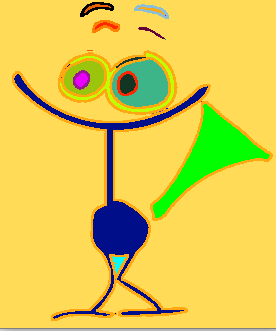
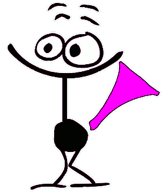
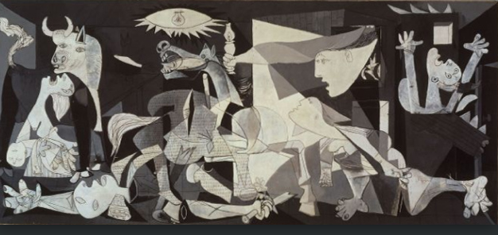
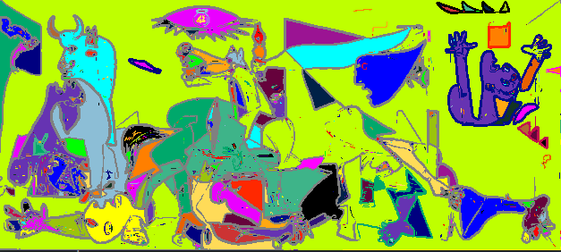
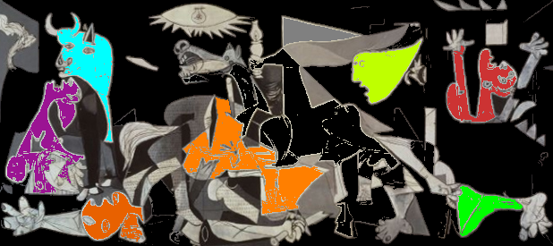
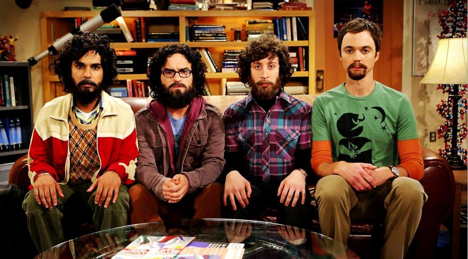
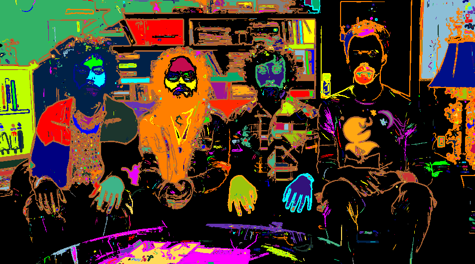
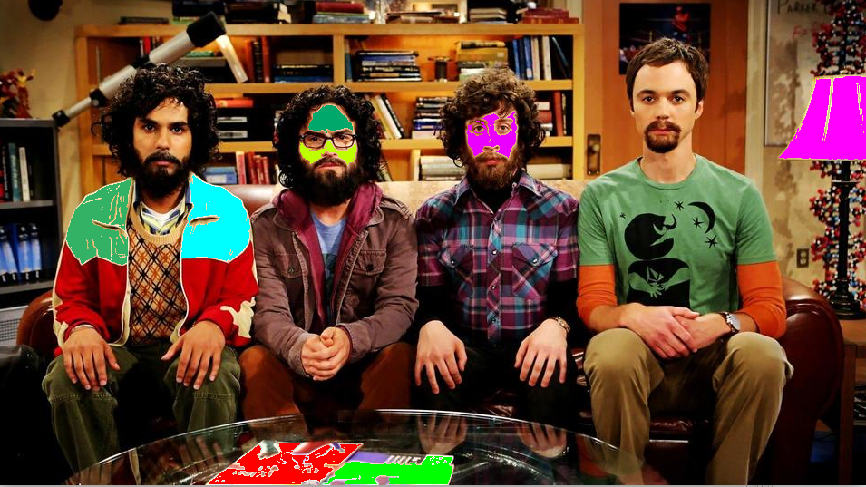

# Implementation details
The project was developed in C programming language. The main files are:

- fasd
- afds
- asdf

# Tests

## Grauna image
  ORIGINAL IMAGE |  USING ALEATORY PAINTING  |     PAINTING WITH LEFT CLICK
---|---|---
 |  |  

## Guernica - Pablo Picasso
  ORIGINAL IMAGE |  USING ALEATORY PAINTING  |     PAINTING WITH LEFT CLICK
---|---|---
 |  |  

## The Big Bang Theory - Series
  ORIGINAL IMAGE |  USING ALEATORY PAINTING  |     PAINTING WITH LEFT CLICK
---|---|---
 |  |  